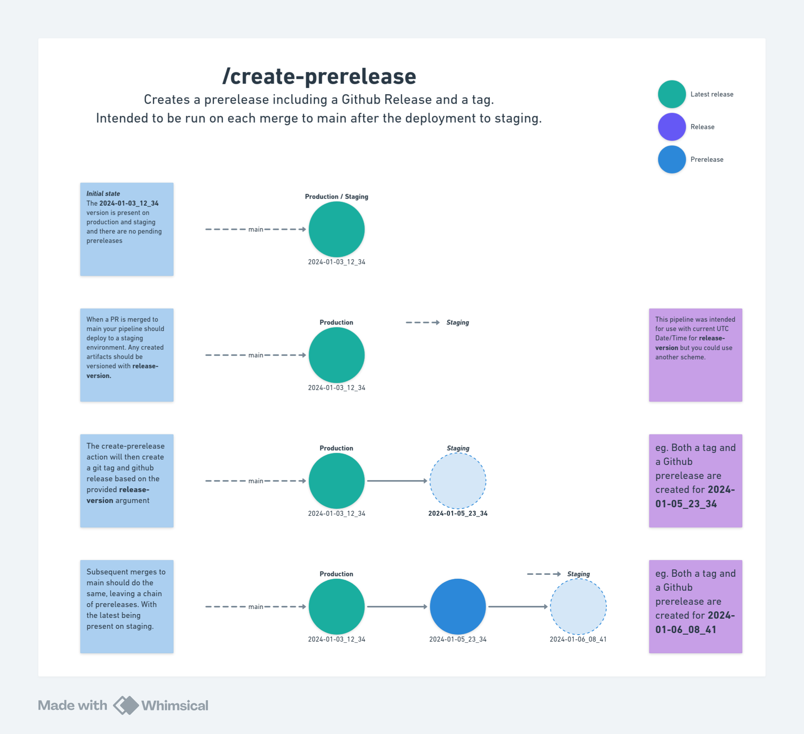

# github-release-action

Optinionated set of github release actions for tagging and deployments.

## Overview

### /create-prerelease



#### Example Usage in a job

```yml
jobs:
  example-main:
    runs-on: ubuntu-latest
    permissions:
      contents: write # Write is required to create/update releases AND to write tags
    environment: staging
    steps:
      - name: Generate version based on date
        run: echo "RELEASE_VERSION=$(date '+%Y-%m-%d_%H_%M')" >> $GITHUB_ENV

      - name: Create some artifacts
        run: echo "Some artifacts created using ${{ env.RELEASE_VERSION }}"

      - name: Deploy to staging
        run: echo "Created artifacts deployed to staging environment"

      - name: Create release
        uses: danielemery/github-release-action/create-prerelease@main # TODO target a static release
        with:
          release-version: ${{ env.RELEASE_VERSION }}
          github-token: ${{ secrets.GITHUB_TOKEN }}
```

### /perform-pre-release & /perform-post-release


#### Example usage in jobs

```yml
jobs:
  example-prepare-production-deployment:
    runs-on: ubuntu-latest
    permissions:
      contents: write # Write is required to create a draft release
    outputs:
      release-id: ${{ steps.pre_release.outputs.release-id }}
      is-existing-release: ${{ steps.pre_release.outputs.is-existing-release }}
    steps:
      - name: Perform pre-release actions
        uses: danielemery/github-release-action/perform-pre-release@main # TODO target a static release
        id: pre_release
        with:
          github-token: ${{ secrets.GITHUB_TOKEN }}
          release-version: ${{github.ref_name}}

  example-deploy-production:
    runs-on: ubuntu-latest
    needs: prepare-production-deployment
    permissions:
      contents: write # Write is required to delete intermediate releases and publish the final release
    environment: production
    steps:
      - name: Deploy to Production
        run: echo "Deployed ${{github.ref_name}} to production"

      - name: Perform post-release actions
        uses: danielemery/github-release-action/perform-post-release@main # TODO target a static release
        with:
          github-token: ${{ secrets.GITHUB_TOKEN }}
          release-id: ${{ needs.prepare-production-deployment.outputs.release-id }}
```

### Implementation notes

#### Race Conditions

In order to prevent race conditions when either two PRs are merged to main at the same time or two people trigger a release at the same time it's recommended to use the `concurrency` flag in your workflows. Note that github only allows 1 pending and one active job per concurrency group so if 3 jobs are run concurrently the middle job will be "failed".

For the merge to main case you can use the below.

```yml
concurrency:
  group: "main"
```

For the release trigger case you can use the below.

```yml
concurrency:
  group: "prod-deployment"
```

## Development

Since the node modules need to be commited to the repo the usual process is:

1. Run `npm ci` to install prod and dev dependencies
2. Make your changes to the ts code in src
3. Run `npm run build` to compile the ts code to js
4. Run `npm ci --omit dev` to remove the dev dependencies
5. Commit the changes to the repo
