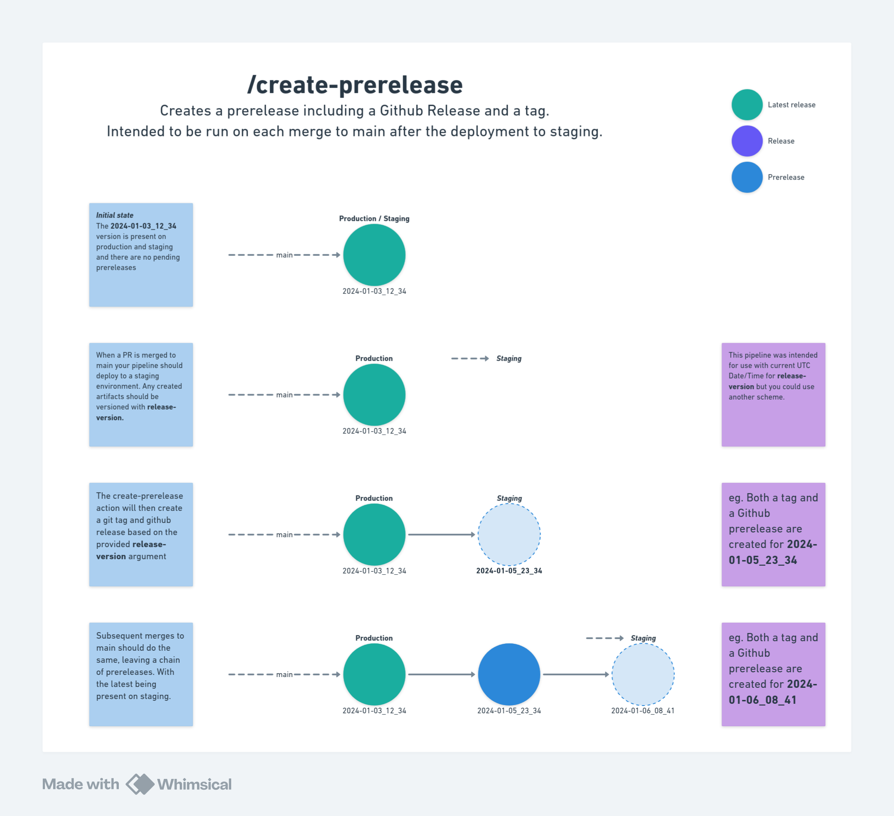
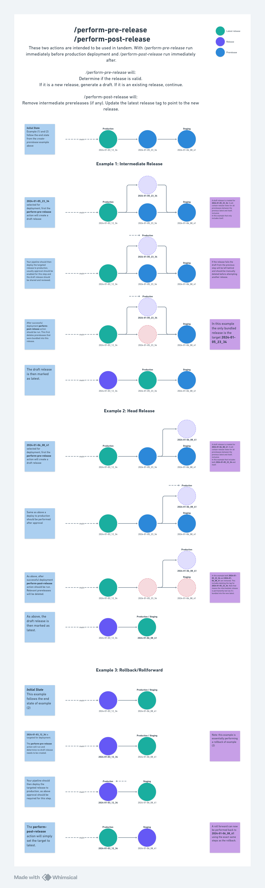

# github-release-actions

Optinionated set of GitHub release actions for tagging and deployments.

Designed to mirror our existing release process where `main` always contains our latest changes but we can promote a specific commit on `main` to production as we see fit.

## Versioning schemes

The actions support two versioning schemes:

- **Date tags** (e.g. `2026-06-12_15_30`): the original and simplest approach. The consuming workflow generates a version string from the current date and passes it to `create-prerelease`.
- **Semver tags** (e.g. `v1.3.0-unstable.0` promoted to `v1.3.0`): the bump type is taken from a `semver:major|minor|patch` label on the PR. Use `validate-semver-label` to gate PRs on having exactly one such label, and `calculate-prerelease-version` to compute the next version from the existing tags.

The core release flow (`create-prerelease`, `perform-pre-release`, `perform-post-release`) works the same with either scheme. `validate-semver-label` and `calculate-prerelease-version` are only relevant for semver tags; if you use date tags they can be ignored.

## Overview

### /create-prerelease



#### Inputs

| Name              | Required | Description                                                                                       |
| ----------------- | -------- | -------------------------------------------------------------------------------------------------- |
| `release-version` | Yes      | Version string for the release.                                                                    |
| `github-token`    | Yes      | Token used to authenticate with the GitHub API, typically the value of `secrets.GITHUB_TOKEN`.    |

#### Example Usage in a job (date tags)

```yml
jobs:
  example-main:
    runs-on: ubuntu-latest
    permissions:
      contents: write # Write is required to create/update releases AND to write tags
    environment: staging
    steps:
      - name: Generate version based on date
        run: echo "RELEASE_VERSION=$(date '+%Y-%m-%d_%H_%M')" >> $GITHUB_ENV

      - name: Create some artifacts
        run: echo "Some artifacts created using ${{ env.RELEASE_VERSION }}"

      - name: Deploy to staging
        run: echo "Created artifacts deployed to staging environment"

      - name: Create release
        uses: danielemery/github-release-actions/create-prerelease@v0.4.0
        with:
          release-version: ${{ env.RELEASE_VERSION }}
          github-token: ${{ secrets.GITHUB_TOKEN }}
```

#### Example Usage in a job (semver tags)

The same flow, but the version comes from `calculate-prerelease-version` (driven by the merged PR's `semver:*` label) instead of the date.

```yml
on:
  pull_request:
    types: [closed]

jobs:
  example-main:
    if: github.event.pull_request.merged == true
    runs-on: ubuntu-latest
    permissions:
      contents: write # Write is required to create/update releases AND to write tags
    environment: staging
    steps:
      - name: Calculate prerelease version
        uses: danielemery/github-release-actions/calculate-prerelease-version@v0.4.0
        id: calculate_version
        with:
          github-token: ${{ secrets.GITHUB_TOKEN }}

      - name: Create some artifacts
        run: echo "Some artifacts created using ${{ steps.calculate_version.outputs.version }}"

      - name: Deploy to staging
        run: echo "Created artifacts deployed to staging environment"

      - name: Create release
        uses: danielemery/github-release-actions/create-prerelease@v0.4.0
        with:
          release-version: ${{ steps.calculate_version.outputs.version }}
          github-token: ${{ secrets.GITHUB_TOKEN }}
```

### /perform-pre-release & /perform-post-release



#### perform-pre-release inputs

| Name              | Required | Description                                                                                       |
| ----------------- | -------- | -------------------------------------------------------------------------------------------------- |
| `release-version` | Yes      | The tag name of the target release.                                                                |
| `github-token`    | Yes      | Token used to authenticate with the GitHub API, typically the value of `secrets.GITHUB_TOKEN`.    |

#### perform-pre-release outputs

| Name                  | Description                                                                    |
| --------------------- | ------------------------------------------------------------------------------ |
| `release-id`          | The numeric github id of the release to be deployed.                           |
| `is-existing-release` | `true` if this is a rollback/roll forward, `false` if this is a new release.   |
| `release-url`         | The Github URL of the release to be deployed.                                  |

#### perform-post-release inputs

| Name           | Required | Description                                                                                       |
| -------------- | -------- | -------------------------------------------------------------------------------------------------- |
| `release-id`   | Yes      | The id of the release that has just been deployed.                                                 |
| `github-token` | Yes      | Token used to authenticate with the GitHub API, typically the value of `secrets.GITHUB_TOKEN`.    |

#### Example usage in jobs

```yml
jobs:
  example-prepare-production-deployment:
    runs-on: ubuntu-latest
    permissions:
      contents: write # Write is required to create a draft release
    outputs:
      release-id: ${{ steps.pre_release.outputs.release-id }}
      is-existing-release: ${{ steps.pre_release.outputs.is-existing-release }}
    steps:
      - name: Perform pre-release actions
        uses: danielemery/github-release-actions/perform-pre-release@v0.4.0
        id: pre_release
        with:
          github-token: ${{ secrets.GITHUB_TOKEN }}
          release-version: ${{github.ref_name}}

  example-deploy-production:
    runs-on: ubuntu-latest
    needs: prepare-production-deployment
    permissions:
      contents: write # Write is required to delete intermediate releases and publish the final release
    environment: production
    steps:
      - name: Deploy to Production
        run: echo "Deployed ${{github.ref_name}} to production"

      - name: Perform post-release actions
        uses: danielemery/github-release-actions/perform-post-release@v0.4.0
        with:
          github-token: ${{ secrets.GITHUB_TOKEN }}
          release-id: ${{ needs.prepare-production-deployment.outputs.release-id }}
```

### /validate-semver-label

Fails unless the PR has exactly one `semver:major`, `semver:minor`, or `semver:patch` label. Intended as an early gate on pull requests so a missing or ambiguous label is caught before merge rather than at release time.

#### Inputs

| Name              | Required | Description                                                                                                                  |
| ----------------- | -------- | ---------------------------------------------------------------------------------------------------------------------------- |
| `github-token`    | Yes      | Token used to construct the API client for the shared action context. The action itself makes no API calls.                 |
| `labels-override` | No       | Override the PR-labels lookup with an explicit list (newline- or comma-separated). When set, event labels are ignored.       |

#### Outputs

| Name   | Description                                     |
| ------ | ----------------------------------------------- |
| `bump` | The validated bump type (major, minor, patch). |

#### Example Usage in a job

```yml
on:
  pull_request:
    types: [opened, labeled, unlabeled, synchronize]

jobs:
  example-validate-label:
    runs-on: ubuntu-latest
    steps:
      - name: Validate semver label
        uses: danielemery/github-release-actions/validate-semver-label@v0.4.0
        with:
          github-token: ${{ secrets.GITHUB_TOKEN }}
```

### /calculate-prerelease-version

Calculates the next prerelease version from the PR's `semver:*` label (or an explicit `bump` input) and the repository's existing tags, producing versions like `v1.2.4-unstable.0`. Tags are listed via the GitHub API, so the consumer's checkout does not need `fetch-depth: 0`.

#### Inputs

| Name                    | Required | Description                                                                                                                  |
| ----------------------- | -------- | ---------------------------------------------------------------------------------------------------------------------------- |
| `github-token`          | Yes      | Token used to list repository tags via the GitHub API.                                                                       |
| `bump`                  | No       | Override the PR-label lookup with an explicit bump type (major\|minor\|patch). When set, `semver:*` labels are ignored.      |
| `prerelease-identifier` | No       | Identifier between the base version and counter, producing `v{base}-{id}.N` (e.g. unstable, beta, rc). Defaults to unstable. |

#### Outputs

| Name             | Description                                                                |
| ---------------- | -------------------------------------------------------------------------- |
| `version`        | Full prerelease version, bare (e.g. `1.2.3-unstable.0`).                   |
| `tag`            | Full prerelease version, v-prefixed (e.g. `v1.2.3-unstable.0`).            |
| `base-version`   | Base version without prerelease suffix, bare (e.g. `1.2.3`).               |
| `base-tag`       | Base version without prerelease suffix, v-prefixed (e.g. `v1.2.3`).        |
| `bump`           | The bump detected from labels or input (major, minor, patch).              |
| `effective-bump` | The bump the resulting version represents relative to the latest stable release (see below). |

#### Clamp-up behaviour and `effective-bump`

If a prerelease line is already in flight with a higher base than the one this PR's bump would produce, the action adopts the in-flight base and continues its sequence rather than starting a divergent lower line (a warning is logged when this happens). For example, with latest stable `v1.2.3` and an in-flight `v1.3.0-unstable.0`, a `semver:patch` PR yields `v1.3.0-unstable.1` — not `v1.2.4-unstable.0`.

`effective-bump` reports the bump the resulting version actually represents relative to the latest stable release. It usually equals `bump`, but is higher when an in-flight base is adopted (in the example above: `bump=patch`, `effective-bump=minor`). A computed base that is higher than the in-flight one (e.g. a major bump) supersedes the in-flight line instead and is not clamped.

#### Example Usage in a job

```yml
jobs:
  example-calculate-version:
    runs-on: ubuntu-latest
    steps:
      - name: Calculate prerelease version
        uses: danielemery/github-release-actions/calculate-prerelease-version@v0.4.0
        id: calculate_version
        with:
          github-token: ${{ secrets.GITHUB_TOKEN }}

      - name: Use the calculated version
        run: echo "Next prerelease is ${{ steps.calculate_version.outputs.tag }}"
```

### Implementation notes

#### Race Conditions

In order to prevent race conditions when either two PRs are merged to main at the same time or two people trigger a release at the same time it's recommended to use the `concurrency` flag in your workflows. Note that github only allows 1 pending and one active job per concurrency group so if 3 jobs are run concurrently the middle job will be "failed".

For the merge to main case you can use the below.

```yml
concurrency:
  group: "main"
```

For the release trigger case you can use the below.

```yml
concurrency:
  group: "prod-deployment"
```

## Prerequisites

Note that the action requires an existing release to be present before it's first run. It's recommended for greenfield projects to push a tag manually for your initial commit and create an auto-generated Github release for that tag using the GitHub UI.

## Development

Since the node modules need to be commited to the repo the usual process is:

1. Run `npm ci` to install prod and dev dependencies
2. Make your changes to the ts code in src
3. Run `npm run build` to compile the ts code to js
4. Run `npm ci --omit dev` to remove the dev dependencies
5. Commit the changes to the repo
